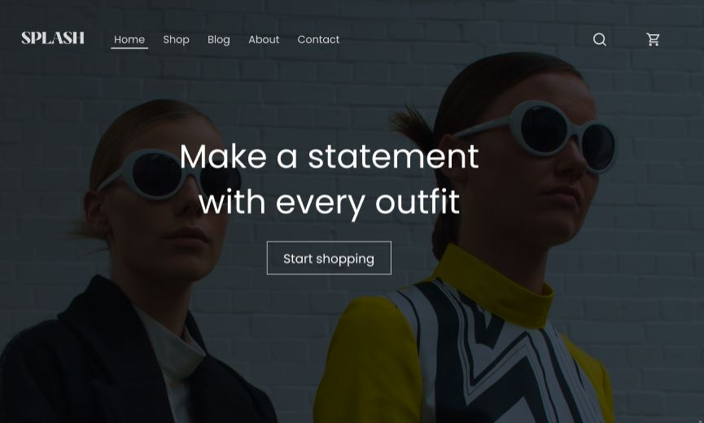

## Table of Contents

- [Unsplash Clothing Store](#unsplash-clothing-store)
  - [Introduction](#introduction)
  - [Features](#features)
  - [Technologies Used](#technologies-used)
  - [Getting Started](#getting-started)
  - [Contributing](#contributing)
  - [Author](#author)
  - [License](#license)

## Unsplash Clothing Store

### Introduction

Welcome to Unsplash Clothing Store, a React and Sass-based web application that offers a wide range of stylish and trendy clothes for customers to explore and purchase. This project showcases the use of React hooks, including useState, useEffect, and useContext, along with Sass for styling. It also includes various features, such as an "Add to Cart" function, "Remove from Cart" functionality, and a product viewing feature.



### Features

- **Product Listings:** Browse through a diverse collection of clothing items, each presented with high-quality images and detailed descriptions.

- **Product View:** Click on a product to view more details, including its name, price, description, and available sizes.

- **Add to Cart:** Easily add your favorite clothing items to the cart with the "Add to Cart" button. The cart icon in the header displays the total number of items in the cart.

- **Remove from Cart:** If you change your mind or want to modify your selection, you can remove items from the cart using the "Remove" button next to each cart item.

- **Cart Summary:** The cart sidebar provides an overview of the items you've added, along with their individual prices and a calculated total.

- **Responsive Design:** This project is built with a responsive design approach, ensuring a seamless and visually appealing experience on both desktop and mobile devices.

### Technologies Used

- **React:** The project is built using the React library, taking full advantage of functional components and hooks for managing state and handling component lifecycles.

- **React Hooks:** Leveraging React hooks like useState, useEffect, and useContext for efficient state management and side-effect handling, providing a smoother user experience.

- **Sass:** Styling is done using Sass, a CSS preprocessor that enables the use of variables, mixins, and other powerful features to create modular and maintainable styles.

- **React Router:** React Router is used to handle navigation between different pages of the application, ensuring a smooth browsing experience.

### Getting Started

1. **Clone the Repository:** Begin by cloning this repository to your local machine using the following command:
   ```
   git clone https://github.com/kizitech/Splash.git
   ```

2. **Install Dependencies:** Navigate to the project directory and install the required dependencies using npm or yarn:
   ```
   cd unsplash-clothing-store
   npm create vite@latest
   ```

3. **Start the Development Server:** Launch the development server with the following command:
   ```
   npm run dev
   ```

4. **Open in Browser:** The application should automatically open in your default web browser. If not, you can access it by visiting `http://localhost:3001` in your browser.

### Contributing

We welcome contributions to enhance the functionality and features of Unsplash Clothing Store. If you encounter any bugs, have suggestions for improvements, or would like to add new features, feel free to create a pull request.

### Author

- LinkedIn - [Ohani Kizito](https://www.linkedin.com/in/ohanikizito/)
- Twitter - [Ohani_Kizito](https://www.twitter.com/Ohani_Kizito)

### License

This project is licensed under the [MIT License](LICENSE).

---

Thank you for choosing Unsplash Clothing Store! We hope you enjoy exploring our selection of fashionable clothing items and have a smooth shopping experience. If you have any questions or feedback, please don't hesitate to get in touch with us. Happy shopping! 🛍️